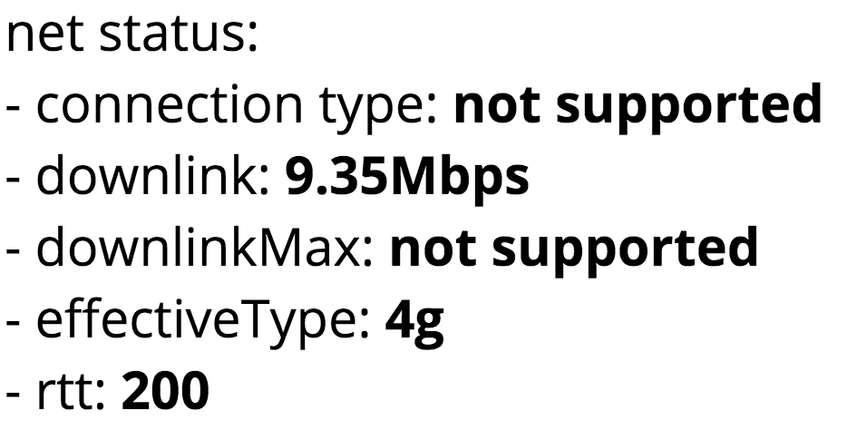

# [net](https://hrubieszowjs.github.io/net/)

> Display current network connection status :globe_with_meridians:

## Demo :gift:

Click here: https://hrubieszowjs.github.io/net/

## Example 

## License

[The MIT License](http://piecioshka.mit-license.org) @ 2018
